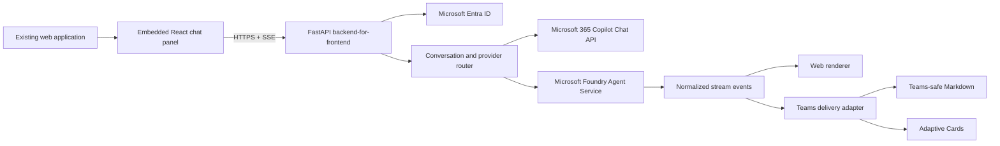

# Agent Experience Blueprints

Reference implementations for embedding Microsoft 365 Copilot-powered chat in custom web applications and delivering responsive, well-formatted Microsoft Foundry agent experiences in Microsoft Teams.

> **Proposed repository name:** `agent-experience-blueprints`
>
> **Short description:** Practical, Microsoft Learn-grounded patterns for embedded web chat, agent streaming, Teams progress updates, Teams-safe Markdown, and Adaptive Cards.

## Why this repository

This repository addresses two recurring enterprise application experience gaps:

1. **Embedded chat in an existing web application**  
   Many organizations need a branded flyout or side panel inside an existing business application rather than an iframe of the full Microsoft 365 Copilot application. The reference pattern uses an application-owned chat UI and a server-side adapter for the Microsoft 365 Copilot Chat API.

2. **Better Microsoft Foundry agent experiences in Teams**  
   Agent implementations can appear frozen while blocking work completes, then return a single poorly formatted message. The reference pattern streams operational progress and response content, uses Teams-safe Markdown for narrative answers, and renders structured results as Adaptive Cards.

All examples use synthetic data and generic branding so the repository can be published publicly.

## Goals

- Provide a simple, embeddable React chat panel for an existing web application.
- Demonstrate Microsoft Entra ID authentication without exposing service credentials in the browser.
- Support multi-turn conversations through a provider-neutral backend contract.
- Stream response content to the browser using Server-Sent Events (SSE).
- Replace blocking agent execution with asynchronous streaming.
- Surface useful operational progress such as `Ingesting`, `Reconciling`, and `Preparing report` without exposing hidden chain-of-thought.
- Deliver responsive Teams experiences with informative updates and response streaming.
- Normalize agent output into narrative text, citations, structured data, and errors.
- Use Teams-safe Markdown for narrative responses and Adaptive Cards for tables, metrics, status summaries, and other structured results.
- Include tests, observability, security guidance, and deployable samples.

## Non-goals

- Embedding or rebranding the full `m365.cloud.microsoft/chat` user interface.
- Reproducing the complete Microsoft 365 Copilot product shell.
- Exposing model reasoning or private chain-of-thought.
- Treating raw Python dictionaries or arbitrary model Markdown as presentation-ready output.
- Supporting long-running Microsoft 365 Copilot Chat API actions such as sending mail or creating files; the API currently returns text and has documented limitations.
- Providing production data, credentials, tenant identifiers, proprietary code, or organization-specific branding.

## Recommended technology stack

| Layer | Recommendation | Purpose |
|---|---|---|
| Web client | React + TypeScript | Embeddable flyout chat UI and host-app integration |
| Web styling | Fluent UI React | Microsoft-aligned, accessible controls and theming |
| API/backend | Python + FastAPI | Authentication boundary, provider adapters, SSE, orchestration |
| Identity | Microsoft Entra ID + MSAL | User sign-in and delegated access |
| Microsoft 365 provider | Microsoft 365 Copilot Chat API | Work- and web-grounded multi-turn chat in the custom UI |
| Foundry provider | Microsoft Foundry Agent Service | Stateful agents, tools, conversations, responses, and streaming |
| Teams delivery | Teams SDK for Python | Personal-chat agent, informative updates, streaming, and final activities |
| Structured UI | Adaptive Cards | Reliable rendering of rows, facts, metrics, status, and actions |
| Testing | Pytest, Playwright, and contract tests | Backend, browser, streaming, cards, and cross-client behavior |
| Observability | OpenTelemetry + Application Insights | Correlation, latency, failures, and stream diagnostics |

## Local development

The current implementation targets Python 3.12. Web samples will target Node.js 22 LTS when they are introduced. The deterministic fake provider requires no Azure subscription, tenant, license, or cloud credentials.

```powershell
py -3.12 -m venv .venv
.venv\Scripts\Activate.ps1
python -m pip install --upgrade pip
python -m pip install -e ".[dev]"
python -m pytest
```

The first implemented slice is the shared `agent_core` package. It provides typed events and outputs, cooperative cancellation, a provider protocol, explicit JSON serialization, a versioned transport schema, and a synthetic three-stage record-reconciliation stream. See [the normalized event contract](docs/contracts.md) for ordering, terminal-event, versioning, and rendering rules.

## Solution architecture



### Core architectural rule

Agent execution and channel rendering are separate concerns. Providers emit normalized events; each channel decides how to present those events.

```text
status            Operational update safe to show to the user
text_delta        Incremental narrative content
citation          Source metadata
structured_result Typed rows, facts, metrics, or status data
final_text        Completed narrative answer
error             User-safe error plus correlation ID
done              Stream completion signal
```

This contract prevents web, Teams, PDF, or other delivery code from calling `str()` on arbitrary objects or joining every intermediate result into one string.

## Repository structure

```text
agent-experience-blueprints/
├── README.md
├── IMPLEMENTATION_PLAN.md
├── LICENSE
├── SECURITY.md
├── CONTRIBUTING.md
├── .env.example
├── apps/
│   ├── web-chat/
│   │   ├── src/components/ChatFlyout/
│   │   ├── src/components/MessageList/
│   │   ├── src/components/ProgressIndicator/
│   │   └── src/lib/chatClient.ts
│   ├── api/
│   │   ├── app/main.py
│   │   ├── app/auth/
│   │   ├── app/providers/m365_copilot.py
│   │   ├── app/providers/foundry.py
│   │   └── app/routes/chat.py
│   └── teams-agent/
│       ├── app.py
│       ├── delivery/streaming.py
│       ├── delivery/markdown.py
│       └── delivery/adaptive_cards.py
├── packages/
│   └── agent_core/
│       ├── events.py
│       ├── orchestration.py
│       ├── output_models.py
│       └── telemetry.py
├── cards/
│   ├── reconciliation-summary.json
│   ├── table-result.json
│   └── error-summary.json
├── chapters/
│   ├── 01-architecture-and-decisions.md
│   ├── 02-embedded-m365-copilot-chat.md
│   ├── 03-foundry-conversations-and-responses.md
│   ├── 04-streaming-and-progress-events.md
│   ├── 05-teams-streaming-ux.md
│   ├── 06-teams-safe-formatting.md
│   ├── 07-adaptive-cards-for-results.md
│   ├── 08-security-observability-and-testing.md
│   └── 09-deployment.md
├── tests/
│   ├── contract/
│   ├── integration/
│   └── e2e/
└── infra/
    ├── bicep/
    └── teams/
```

## Chapters and learning path

### 1. Architecture and decisions

- Compare iframe embedding with an application-owned chat UI.
- Explain why the full Microsoft 365 Copilot UI is not the customization boundary.
- Select Microsoft 365 Copilot Chat API, Foundry Agent Service, or both through adapters.
- Document preview dependencies, licensing, tenant readiness, and fallback options.

### 2. Embedded Microsoft 365 Copilot chat

- Build a responsive flyout component that can be mounted in an existing CRM.
- Use the Microsoft 365 Copilot Chat API for multi-turn, work-grounded conversations.
- Keep tokens and service calls behind the backend-for-frontend.
- Use the streamed endpoint and SSE so the UI renders content progressively.
- Display citations, retry states, cancellation, and accessible status announcements.

### 3. Foundry conversations and responses

- Model reusable behavior as versioned agents.
- Use conversations when server-side, multi-turn continuity is required.
- Treat every invocation as a response with inspectable output items.
- Preserve typed tool calls and structured outputs instead of flattening them into text.

### 4. Streaming and progress events

- Replace blocking `workflow.run()` paths with an asynchronous streaming interface such as `workflow.run_stream()`.
- Emit named operational milestones after meaningful stages.
- Stream text deltas independently from status events.
- Support cancellation, timeouts, retries, backpressure, and disconnect cleanup.
- Never label hidden model reasoning as progress; report only actual system operations.

### 5. Teams streaming UX

- Start with informative updates such as `Reading inputs`, `Reconciling records`, and `Preparing summary`.
- Switch to cumulative response streaming when answer text is available.
- Send a final message activity when generation finishes.
- Buffer output to a steady cadence rather than sending every token.
- Respect Teams constraints: personal chat only for streaming, one concurrent stream per chat, sequential updates, cumulative content, and the documented streaming time and size limits.

### 6. Teams-safe formatting

- Define a strict renderer for the supported narrative subset: bold, italic, ordered lists, unordered lists, and links.
- Remove or transform unsupported headers, tables, images, blockquotes, and preformatted text.
- Apply output instructions to the reporting agent, but keep a deterministic sanitizer because prompt instructions alone are not a rendering contract.
- Test desktop, web, iOS, and Android rendering differences.

### 7. Adaptive Cards for structured results

- Convert typed result models to cards; never parse presentation data back out of prose.
- Use `FactSet`, containers, columns, and repeated text blocks for summaries and rows.
- Provide compact and expanded layouts where appropriate.
- Validate schemas and payload sizes in automated tests.
- Attach cards to the final message rather than intermediate streaming updates.

### 8. Security, observability, and testing

- Use delegated identity and least privilege.
- Keep secrets in managed configuration, not source or browser code.
- Avoid logging prompts, retrieved content, tokens, or card payloads unless explicitly approved and protected.
- Correlate browser requests, provider responses, Teams activities, and failures.
- Measure acknowledgement latency, first-content latency, completion latency, cancellation, throttling, and rendering failures.

### 9. Deployment

- Deploy the API to Azure Container Apps or App Service.
- Host the React bundle independently or inside the existing application.
- Package the Teams app for personal scope.
- Use Bicep for repeatable infrastructure and environment-specific configuration.
- Add a release checklist for preview API changes and dependency updates.

## Key experience patterns

### Web acknowledgement pattern

1. User submits a message.
2. UI immediately shows an accessible working state.
3. Backend emits one or more operational `status` events.
4. Backend emits `text_delta` events as response content arrives.
5. UI replaces the working state with the final answer and citations.
6. User can cancel, retry, copy, or start a new conversation.

### Teams delivery pattern

1. Start an informative stream update.
2. Publish stage updates only when the stage actually begins or completes.
3. Switch to cumulative response streaming.
4. Normalize and sanitize final narrative text.
5. Convert structured results to an Adaptive Card.
6. Send the final message with citations, labels, feedback controls, and attachments as supported.

## Definition of a good sample

A chapter is complete when it includes:

- A runnable sample.
- A concise explanation of the problem and tradeoffs.
- Configuration through `.env.example` without secrets.
- Automated happy-path and failure-path tests.
- Accessibility notes.
- Security and privacy notes.
- Links to the governing Microsoft Learn documentation.
- A screenshot or short recording created from synthetic data.

## Important product notes

- The Microsoft 365 Copilot Chat API is currently documented as preview.
- It supports multi-turn conversations, enterprise search grounding, web search grounding, and synchronous or streamed responses.
- Its streamed endpoint uses SSE so custom applications can render output progressively.
- It requires a Microsoft 365 Copilot add-on license and currently returns text rather than action or content-generation capabilities.
- Microsoft Learn recommends streaming for real-time Foundry experiences; conversations provide persistent multi-turn history, while responses represent individual executions.
- Teams streaming is currently documented for one-on-one chats and one concurrent streaming response per chat.
- Teams Markdown is a subset. Headers, tables, images, preformatted text, and blockquotes are not supported in Adaptive Card Markdown fields.

## Microsoft Learn references

Reviewed August 19, 2026:

- [Microsoft 365 Copilot Chat API overview](https://learn.microsoft.com/en-us/microsoft-365/copilot/extensibility/api/ai-services/chat/overview)
- [Foundry Agent Service runtime components](https://learn.microsoft.com/en-us/azure/foundry/agents/concepts/runtime-components)
- [Stream agent messages in Teams](https://learn.microsoft.com/en-us/microsoftteams/platform/bots/streaming-ux)
- [Format cards in Teams](https://learn.microsoft.com/en-us/microsoftteams/platform/task-modules-and-cards/cards/cards-format)
- [Adaptive Cards documentation](https://adaptivecards.microsoft.com/)

## Suggested repository metadata

- **Repository:** `agent-experience-blueprints`
- **Display name:** Agent Experience Blueprints
- **Description:** Reference implementations for embedded Microsoft 365 Copilot chat and responsive Microsoft Foundry agent experiences in Microsoft Teams.
- **Topics:** `microsoft-365-copilot`, `microsoft-foundry`, `teams`, `adaptive-cards`, `agents`, `streaming`, `react`, `fastapi`, `python`
- **Visibility:** Public, following security, legal, contribution, and preview-dependency reviews.
- **License:** To be selected before public release.

## Status

Milestones 0 and 1 are in progress. The repository foundation and initial shared event contracts are implemented; web, cloud-provider, and Teams adapters remain planned. See `IMPLEMENTATION_PLAN.md` for milestones, work items, acceptance criteria, risks, and the proposed release sequence.
